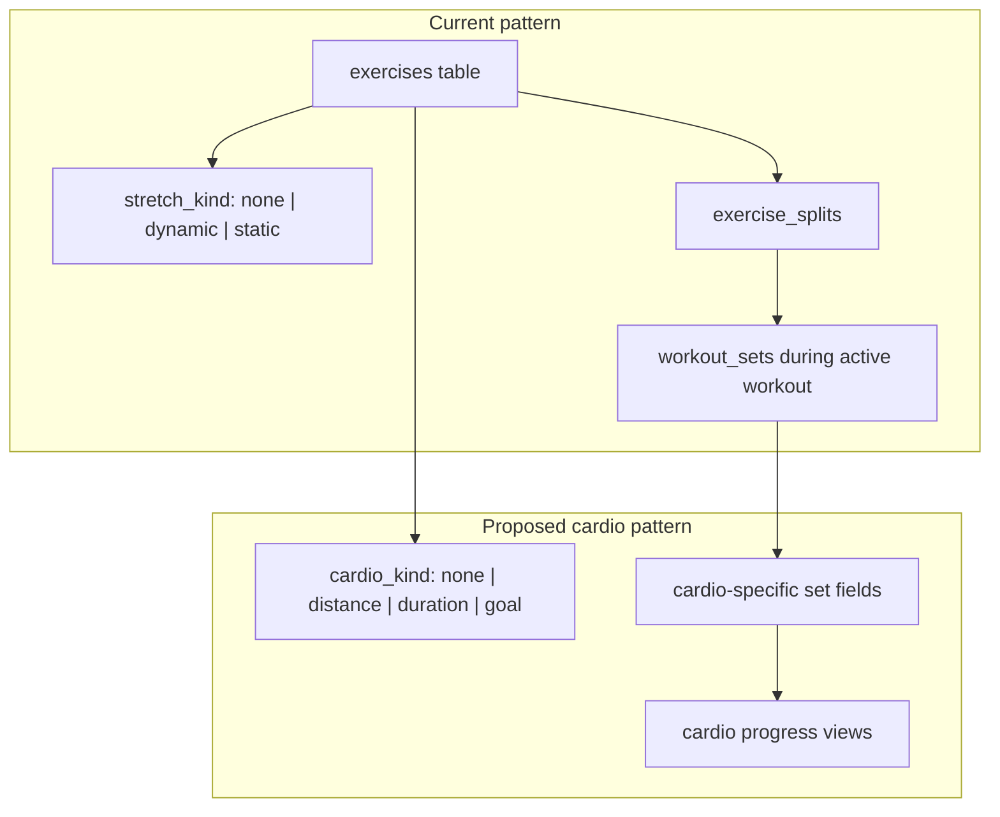

# Cardio Tracking Plan (#83)

**Status:** Planning only — not implemented  
**Created:** 2026-07-12  
**Related issue:** [swesan123/gym-app#83](https://github.com/swesan123/gym-app/issues/83)

## Goal

Add cardio activities (running, cycling, rowing, etc.) as a first-class exercise category in the gym app — modeled like stretches today, not as a separate `runs` table. Cardio exercises live in splits, log during active workouts, and show cardio-specific progress charts.

## Design principle: mirror the stretch pattern

Stretches use `stretch_kind` (`none` | `dynamic` | `static`) on `exercises` to change UI sections, validation, and progress exclusion. Cardio should follow the same pattern with a new `cardio_kind` (or extended `stretch_kind`) field rather than a standalone running module.



---

## Apple Fitness reference (workout type taxonomy)

Apple Watch / Fitness exposes many workout types. For v1, adopt a **curated subset** mapped to our `cardio_kind` + `tracking_type` model rather than 80+ Apple types.

### Tier 1 — implement first (running focus)

| Apple type | Our `cardio_kind` | Primary fields | Progress metric |
|------------|-------------------|----------------|-----------------|
| Outdoor Run | `distance` | distance, duration | pace (min/km or min/mi), weekly distance |
| Indoor Run / Treadmill | `distance` | distance, duration | pace, weekly distance |
| Outdoor Walk | `distance` | distance, duration | pace, weekly distance |
| Indoor Walk | `distance` | distance, duration | pace, weekly distance |

### Tier 2 — same `distance` kind, different exercise presets

| Apple type | Notes |
|------------|-------|
| Hiking | distance + duration + optional elevation (future) |
| Cycling (Outdoor/Indoor) | distance + duration → speed instead of pace |
| Rowing (Indoor/Outdoor) | distance + duration, or strokes (future) |
| Elliptical | distance + duration |
| Stair Stepper / Stairs | duration-first; distance optional |

### Tier 3 — `duration` kind (time-only cardio)

| Apple type | Primary fields |
|------------|----------------|
| Jump Rope | duration |
| HIIT | duration (+ optional rounds, future) |
| Mixed Cardio | duration |
| Dance | duration |
| Kickboxing | duration |

### Tier 4 — `goal` kind (target-based)

Apple's "goal" workouts often use open goals or distance/time targets. Map to:

| Goal type | Fields | Example |
|-----------|--------|---------|
| Time goal | `goal_duration_seconds`, actual `duration_seconds` | "Run 30 min" |
| Distance goal | `goal_distance_meters`, actual `distance_meters` | "Run 5 km" |
| Open | duration only, no preset goal | "Just run" |

**Reference links:**
- [Workout types on Apple Watch](https://support.apple.com/en-us/105089)
- [Start a workout in Fitness on iPhone](https://support.apple.com/guide/iphone/start-a-workout-in-fitness-iph8475d8510/ios)
- [Apple Fitness+ workout types](https://support.apple.com/en-us/108761) (HIIT, Treadmill, Cycling, Rowing, Dance, Kickboxing)

---

## Schema changes (proposed)

### Option A — extend `stretch_kind` → `activity_kind` (breaking rename)

Rename `stretch_kind` to `activity_kind`: `none` | `dynamic` | `static` | `cardio_distance` | `cardio_duration` | `cardio_goal`.

**Pros:** Single column, one partition function  
**Cons:** Migration + widespread rename

### Option B — add `cardio_kind` alongside `stretch_kind` (recommended)

```sql
-- New enum-like check on exercises
ALTER TABLE exercises
  ADD COLUMN cardio_kind text NOT NULL DEFAULT 'none'
  CHECK (cardio_kind IN ('none', 'distance', 'duration', 'goal'));

-- Cardio-specific defaults on exercise
ALTER TABLE exercises
  ADD COLUMN default_distance_meters numeric,
  ADD COLUMN default_duration_seconds integer,
  ADD COLUMN goal_distance_meters numeric,
  ADD COLUMN goal_duration_seconds integer;
```

```sql
-- Extend workout_sets for logged cardio data
ALTER TABLE workout_sets
  ADD COLUMN distance_meters numeric,
  ADD COLUMN goal_distance_meters numeric,
  ADD COLUMN goal_duration_seconds integer;
-- duration_seconds already exists (used by timed stretches)
```

**Validation rules by `cardio_kind`:**

| cardio_kind | Required set fields | Done gate |
|-------------|---------------------|-----------|
| `none` | (existing strength/stretch rules) | unchanged |
| `distance` | `distance_meters`, `duration_seconds` | both required |
| `duration` | `duration_seconds` | required |
| `goal` | actual + goal fields per exercise config | both required |

**Derived metrics (computed, not stored):**
- `pace_sec_per_km = duration_seconds / (distance_meters / 1000)`
- `speed_kmh = (distance_meters / 1000) / (duration_seconds / 3600)`

---

## UI changes (proposed)

### Settings → Exercises

- Add **Cardio kind** selector (like Stretch kind today): None / Distance / Duration / Goal
- When cardio ≠ none:
  - Hide RIR, reps, weight columns (like stretches hide RIR)
  - Show cardio-specific defaults (target distance, target duration, goal fields)
  - `muscle` could default to `"Cardio"` or a cardio subcategory (Run, Cycle, Row)

### Settings → Splits

- New section in split exercise list: **Cardio** (after Static stretches), same as Dynamic / Main / Static partition in [`partitionGroupsByStretchKind.ts`](../components/workout/partitionGroupsByStretchKind.ts)
- Rename helper to `partitionGroupsByActivityKind` or add parallel cardio partition

### Active workout (List + Focus)

- Distance cardio: fields for **Distance** (km/mi picker) + **Duration** (or use existing timed countdown)
- Duration cardio: duration only + optional timer (reuse [`useSetEditor`](../components/workout/useSetEditor.ts) timed flow)
- Goal cardio: show goal vs actual (e.g. "5.0 km / 5.0 km goal")
- No volume column (cardio excluded from volume views, like stretches)
- No RIR

### Progress page

New charts (separate from strength RIR-adjusted charts in #80):

| Chart | Data source |
|-------|-------------|
| Weekly distance by exercise | `weekly_distance_by_exercise` view |
| Average pace trend | `weekly_pace_by_exercise` view |
| Total cardio duration per week | `weekly_cardio_duration` view |

Filter by split (reuse existing split filter pattern from [`ProgressCharts.tsx`](../components/progress/ProgressCharts.tsx)).

### Home / Nav

- No separate "Running" page required — cardio lives in splits like any exercise
- Optional: Progress sub-tab or filter preset "Cardio only"

---

## Progress views (proposed SQL)

```sql
-- Weekly distance + pace for distance-based cardio
CREATE VIEW weekly_distance_by_exercise AS
SELECT
  w.week,
  e.id AS exercise_id,
  e.name AS exercise,
  e.cardio_kind,
  SUM(ws.distance_meters) AS total_distance_meters,
  SUM(ws.duration_seconds) AS total_duration_seconds,
  -- weighted average pace
  CASE WHEN SUM(ws.distance_meters) > 0
    THEN SUM(ws.duration_seconds) / (SUM(ws.distance_meters) / 1000.0)
    ELSE NULL END AS avg_pace_sec_per_km
FROM workout_sets ws
JOIN workouts w ON w.id = ws.workout_id
JOIN exercises e ON e.id = ws.exercise_id
WHERE w.status = 'completed'
  AND ws.completed_at IS NOT NULL
  AND e.cardio_kind = 'distance'
GROUP BY w.week, e.id, e.name, e.cardio_kind;
```

Similar views for `duration` and `goal` kinds.

---

## Implementation phases

### Phase C1 — Schema + exercise settings
- Migration: `cardio_kind` + set columns
- Exercise settings form: cardio kind selector + defaults
- Seed example: "Outdoor Run" on a Rest day or dedicated Cardio split

### Phase C2 — Active workout logging
- Extend `isSetReadyToComplete` for cardio kinds
- List + Focus field layouts for distance/duration/goal
- Unit tests for validation + pace calculation (`lib/cardioMetrics.ts`)

### Phase C3 — Split integration
- Cardio section in split settings + active workout partition
- Pre-fill from last session (distance, duration, pace targets)

### Phase C4 — Progress charts
- SQL views for distance, pace, duration
- `CardioProgressCharts` component or extend `ProgressCharts`
- Split filter support

### Phase C5 — Polish
- km/mi user preference (profile setting)
- Goal progress indicator ("92% of distance goal")
- Preset distances (5K, 10K) like Apple Time to Run

---

## Out of scope for v1

- GPS / live route tracking
- Apple Health / Strava import
- Elevation, heart rate, cadence
- Audio coaching (Apple Time to Run style)
- Separate `runs` table detached from workout flow

---

## Open questions (decide before implementation)

1. **Distance units:** Store meters internally, display km vs mi from profile preference?
2. **`cardio_kind` vs extending `stretch_kind`:** Option B (separate column) recommended — keeps stretch logic untouched.
3. **Cardio in volume views:** Exclude entirely (like stretches) — yes.
4. **Single cardio exercise per split or many:** Many (e.g. Run + Row + HIIT same day).
5. **Warmup sets for cardio:** `set_type` still exists in DB but UI was removed (#63). Cardio should not depend on warmup filtering — use `completed_at IS NOT NULL` only.

---

## Files likely touched (when implemented)

| Area | Files |
|------|-------|
| Schema | `supabase/migrations/YYYYMMDD_add_cardio_kind.sql` |
| Types | `lib/database.types.ts` |
| Validation | `lib/setCompletion.ts`, `lib/cardioMetrics.ts` |
| Settings | `components/settings/ExerciseSettingsClient.tsx`, `SplitSettingsClient.tsx` |
| Workout UI | `ActiveWorkout.tsx`, `FocusSetCard.tsx`, `partitionGroupsByStretchKind.ts` |
| Actions | `app/actions/exercises.ts`, `app/actions/workouts.ts` |
| Progress | `app/progress/page.tsx`, `components/progress/ProgressCharts.tsx` |
| Tests | `lib/cardioMetrics.test.ts`, `lib/setCompletion.test.ts` |

---

## Acceptance criteria

- [ ] User can create an "Outdoor Run" exercise with `cardio_kind = distance` and add it to a split
- [ ] During active workout, user logs distance + duration and marks set Done
- [ ] Pace is computed and visible on completed workout summary
- [ ] Progress page shows weekly distance and pace trend for cardio exercises
- [ ] Cardio exercises do not appear in strength volume charts
- [ ] Duration-only cardio (Jump Rope) works with timer flow
- [ ] Goal-based cardio shows progress toward configured target
